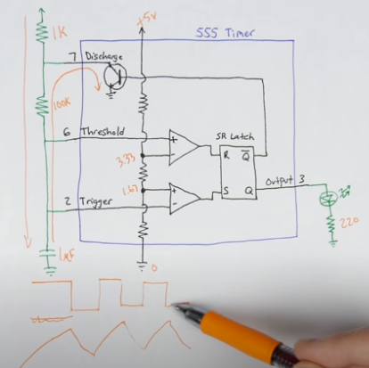
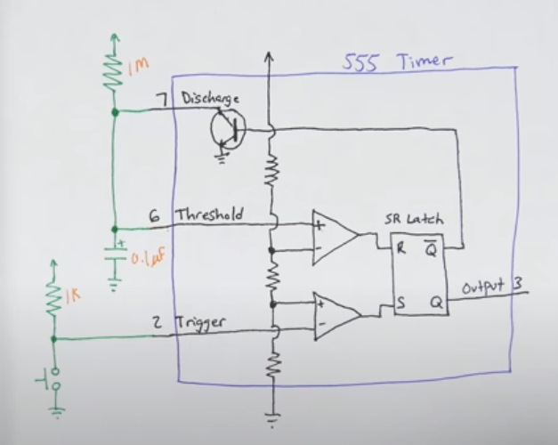
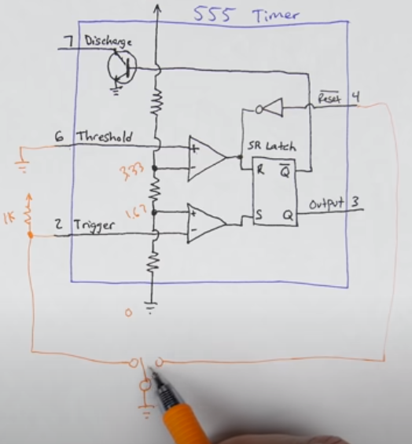
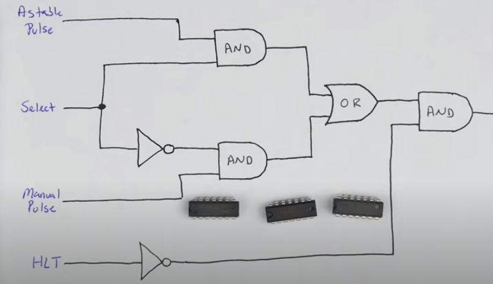

## 8-Bit Computer
----
Ben-Eater

***Clock***
1. Astable 555 timer

2. Monostable timer
(switch debouncing solution)

3. Bistable Timer
(configured as a bistable multivibrator to debounce the toggle switch for selecting between the clock oscillator and manual clock stepping)

4. Clock Module

